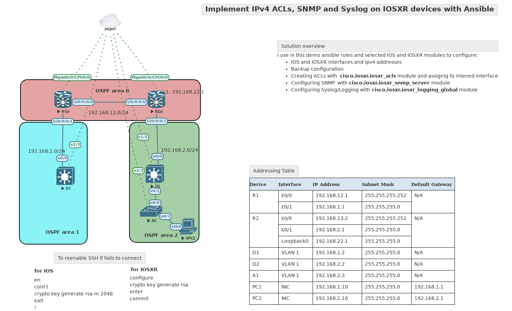

# Configuring ACLs, SNMP and Syslog on IOSXR with Ansible

#### Short summary

Eve-ng topology is stored in **eveng/** directory. I used eve-ng pro version. Please use Python virutal Environments. Playbook was tested only with Ansible 2.13.5 version. Backups are stored in backups/ dir.

#### Please use Python venv

`source venv/bin/activate`

#### Topology



##### File structure

``` cmd
tree -L 2
.
├── acl_example.txt
├── acls
│   ├── NMS.cfg
│   └── R1xr.cfg
├── add_acls.yml
├── Ansible_ACLs.png
├── ansible.cfg
├── backups
│   ├── POST-CRQ_R3_xr_2022-11-21T13:34:14Z.cfg
│   ├── POST-CRQ_R3_xr_2022-11-21T13:39:21Z.cfg
│   ├── POST-CRQ_R3_xr_2022-11-21T13:41:53Z.cfg
│   ├── PRE-CRQ_A2_2022-11-04T08:14:35Z.cfg
│   ├── PRE-CRQ_A2_2022-11-04T08:46:15Z.cfg
│   ├── PRE-CRQ_A2_2022-11-04T09:40:31Z.cfg
│
├── collections
│   └── requirements.yml
├── command_output.txt
├── config
│   ├── A2_interface_config_lstrip.txt
│   ├── D1_interface_config_lstrip.txt
│   ├── D2_interface_config_lstrip.txt
│   ├── R1_interface_config_lstrip.txt
│   └── R2_interface_config_lstrip.txt
├── eveng
│   └── eve_ng_pro_ACLs_SNMP_Syslog_IOSXR.zip
├── full_config.yml
├── group_vars
│   ├── access.yml
│   ├── core.yml
│   └── routersxr.yml
├── hosts
├── host_vars
│   ├── A2.yml
│   ├── D1.yml
│   ├── D2.yml
│   ├── R1xr.yml
│   └── R2xr.yml
├── iosxr_acls.yml
├── iosxr_basic-cfg
├── iosxr_config.yml
├── iosxr_interfaces.yml
├── iosxr_ospf2.yml
├── iosxr_ospf.cfg
├── iosxr_ospf.j2
├── iosxr_ospf.yml
├── iosxr_snmp.yml
├── iosxr_syslog.yml
├── l2_parsed.cfg
├── ospfconfig
│   ├── "R2xr".cfg
│   └── "R3_xr".cfg
├── ospf_gathered.yml
├── R1_acls.cfg
├── README.md
├── requirements.txt
├── roles
│   ├── acls
│   ├── backup_config
│   ├── ios_rtr_interfaces
│   ├── iosxr_interfaces
│   ├── motd_banner
│   ├── ospf
│   ├── routes
│   ├── save_config
│   ├── snmp
│   ├── static_routes
│   ├── sw_interfaces
│   ├── sw_ip_routing
│   └── syslog
├── venv
│   ├── bin
│   ├── include
│   ├── lib
│   ├── lib64 -> lib
│   ├── pyvenv.cfg
│   └── share
└── venv-29
    ├── bin
    ├── include
    ├── lib
    ├── lib64 -> lib
    ├── pyvenv.cfg
    └── share

```

#### How to push configuration with Ansible playbook(s). 

It requreis to execute only a single command:

`ansible-playbook full_config.yml`

or you can run several plabooks separately:

```cli
── iosxr_acls.yml
├── iosxr_config.yml
├── iosxr_interfaces.yml
├── iosxr_ospf2.yml
├── iosxr_ospf.yml
├── iosxr_snmp.yml
├── iosxr_syslog.yml
```

#### For this lab I use:

* Ansible roles
* **jinja2** templates to configure IOS loopback  interface 
* **iosxtr_acls** & **iosxtr_acl_interfaces**
* **ios_banner** & **iosxr_banner**
* **iosxr_snmp_server module** for SNMP configuration 
* **iosxr_logging_global** module for Remote Syslog configuration


However for this lab due to bugs in iosxr_config module and iosxr_ospf_interfaces  I could not apply OSPF configuration from ansible.

```yaml
# That should look like OSPF interface configuration but looks like some bugs in iosxr_ospf_interfaces module.
# no rendered output is generated
    - name: OSPF interfaces configuration
      cisco.iosxr.iosxr_ospf_interfaces:
        config:
          - name: "{{ item.1.name }}"
            type: gigabitethernet
            address_family:
              - afi: ipv4
                processes:
                  - process_id: "{{ ospf.process_id }}"
                    area:
                      area_id: "{{ item.0.area_id  }}"
        # state: rendered
        state: merged
      when: ospf is defined
      # loop: "{{ ospf.areas.area_id }}"
      # loop_control:
      #   label: "{{ item.name }}"
      with_subelements:
        - "{{ ospf.areas }}"
        - interfaces
```

I also tried different apporach but also does not work.

```yaml
    - name: Collect ios_facts
      cisco.iosxr.iosxr_facts:
        gather_subset:
          - min
      register: facts
      tags: hwinfo

    - name: Generate config from jinja template
      ansible.builtin.template:
        src: iosxr_ospf.j2
        dest: ./ospfconfig/"{{ ansible_net_hostname }}".cfg
        backup: true
        mode: 0640

    - name: Setup OSPF
      cisco.iosxr.iosxr_config:
        src: ./ospfconfig/"{{ ansible_net_hostname }}".cfg
        replace: config

```

##### Where iosxr_ospf.j2 config looks like:

```jinja2

router ospf {{ ospf.process_id }}
router-id {{ ospf.router_id }}
 auto-cost reference-bandwidth {{ ospf.auto_cost.reference_bandwidth }}
 address-family ipv4 unicast

  area {{ item.area_id }}

   interface {{ intf.name }}

  network {{ intf.network }}
{#p2p#}

 
  passive enable
{#-passivetrue-#}
{#passive#}
{#intf#}
{#areas#}
{#ospf#}
```

##### Device variables for R1xr rotuer

``` yaml
interfaces:
 - name: GigabitEthernet0/0/0/0
   description: Link to R1 configured by Ansible
   ipv4: 192.168.12.2/30
  #  ipv6: 2001:db8:acad:12::2/64
  #  link_local: fe80::12:2
  
 - name: GigabitEthernet0/0/0/1
   description: Link to D2 configured by Ansible
   ipv4: 192.168.2.1/24
  #  ipv6: 2001:db8:acad:23::2/64
  #  link_local: fe80::23:2
   cdp: 'no'


 - name: Loopback 1
   description: Loopback 1 configured by Ansible
   ipv4: 192.168.22.1/24
  #  ipv6: 2001:db8:acad:1::1/64
  #  link_local: fe80::1:1

# OSPF config data# OSPF config data
ospf:
  process_id: 2
  router_id: 2.2.2.2
  default_orignate: "false"
  auto_cost:
    reference_bandwidth: "1000"

  areas:
    - area_id: 0.0.0.0
      interfaces:
        - name: GigabitEthernet0/0/0/0
          network: "point-to-point"
          passive: "false"
    - area_id: 0.0.0.2
      interfaces:
        - name: GigabitEthernet0/0/0/1
          network: point-to-point
          passive: "false"
        - name: Loopback1
          network: point-to-point
          passive: "true"


```

##### group_vars/routersxr.yml

``` yaml
---
ansible_connection: network_cli
ansible_become: yes
ansible_become_method: enable
ansible_network_os: iosxr
ansible_user: ansi
ansible_password: C1sc0123!
allowed_vlans: 10-20,40
native: 10

SNMP:
  acl_name: NMS-SERVER
#  snmp-server location D1 Rack 1
#  snmp-server contact Student 555-1213
#  snmp-server chassis-id Cisco Device D1
  location: "swtlab"
  contact: "swt"
  chassis_id: "IOSXR-R1xr"
  community:
    rw: "true"
    name: "SwtLabCommunity"
  NMSaddr: "192.168.1.50"
  ver: "2c"
  # snmp-server enable traps
  traps_enable: true
  enabled_traps:
    config: true
    hsrp: true
    ipsla: true
    ntp: true
    ospf: true
...

```

##### IOSXR interface configuration

```yaml
- name: Play to set up IOSXR
  hosts: routersxr
  gather_facts: false
  tasks:
    - name: Setup interfaces
      cisco.iosxr.iosxr_interfaces:
        config:
          - name: "{{ item.name }}"
            description: "{{ item.description }}"
            enabled: "true"

        state: merged
      loop: "{{ interfaces }}"
      loop_control:
        label: "{{ item.name }}"
      # when: "item.L3 is defined"
      tags: intf

    - name: Configure IPv4 adresses
      cisco.iosxr.iosxr_l3_interfaces:
        config:
          - name: "{{ item.name }}"
            ipv4:
              - address: "{{ item.ipv4 }}"
            # ipv6:other_settings:
            #   - address: "{{ item.ipv6 }}"

      loop: "{{ interfaces }}"
      loop_control:
        label: "{{ item.name }}"
      tags: intf_l3
      #when: "'Loopback' not in item.name"
```

#### IOSXR ACL configuration

``` yaml
- name: Play to set up IOSXR
  hosts: routersxr
  gather_facts: false
  tasks:
    - name: Setup interfaces
      cisco.iosxr.iosxr_interfaces:
        config:
          - name: "{{ item.name }}"
            description: "{{ item.description }}"
            enabled: "true"

        state: merged
      loop: "{{ interfaces }}"
      loop_control:
        label: "{{ item.name }}"
      # when: "item.L3 is defined"
      tags: intf

    - name: Configure IPv4 adresses
      cisco.iosxr.iosxr_l3_interfaces:
        config:
          - name: "{{ item.name }}"
            ipv4:
              - address: "{{ item.ipv4 }}"
            # ipv6:other_settings:
            #   - address: "{{ item.ipv6 }}"

      loop: "{{ interfaces }}"
      loop_control:
        label: "{{ item.name }}"
      tags: intf_l3
      #when: "'Loopback' not in item.name"
```

#### SNMP configuration

``` yaml
---
- name: Set SNMP for IOSXR devices if defined
  hosts: routersxr
  gather_facts: false
  tasks:

    - name: Create ACLs for SNMP NMS
      cisco.iosxr.iosxr_acls:
        running_config: "{{ lookup('file', 'acls/NMS.cfg') }}"
        state: parsed
      register: acl_parsed

    # - name: Display Parsed
    #   ansible.builtin.debug:
    #     var: acl_parsed

    - name: Do reconciliation of parsed ACL
      cisco.iosxr.iosxr_acls:
        config: "{{ acl_parsed.parsed }}"
        state: replaced
      register: acl_ran

    - name: Enable SNMP
      cisco.iosxr.iosxr_snmp_server:
        state: merged
        config:
          location: "{{ SNMP.location }}"
          chassis_id: "{{ SNMP.chassis_id }}"
          communities:
            - name: "{{ SNMP.community.name }}"
              acl_v4: "{{ SNMP.acl_name }}"
              rw: "{{ SNMP.community.rw }}"
          contact: "swt"
          hosts:
            - community: CCNPv9
              host: "{{ SNMP.NMSaddr }}"
              traps: "{{ SNMP.traps_enable }}"
              version: "{{ SNMP.ver }}"
          traps:
            config: true
            hsrp: true
            ipsla: true
            ntp: true
            power: true
            syslog: true
            ipsec:
              start: true
              stop: true

```

#### Syslog configuration

``` yaml
---
- name: Set ACLs
  hosts: routersxr
  gather_facts: false
  tasks:

    - name: Configure logging
      cisco.iosxr.iosxr_logging_global:
        config:
          buffered:
            size: "2097152"
          facility: "local5"
          events:
            display_location: "true"
          hosts:
            - host: "10.10.7.254"
              port: "514"
              severity: "error"
          trap:
            severity: "errors"
        state: merged


```
